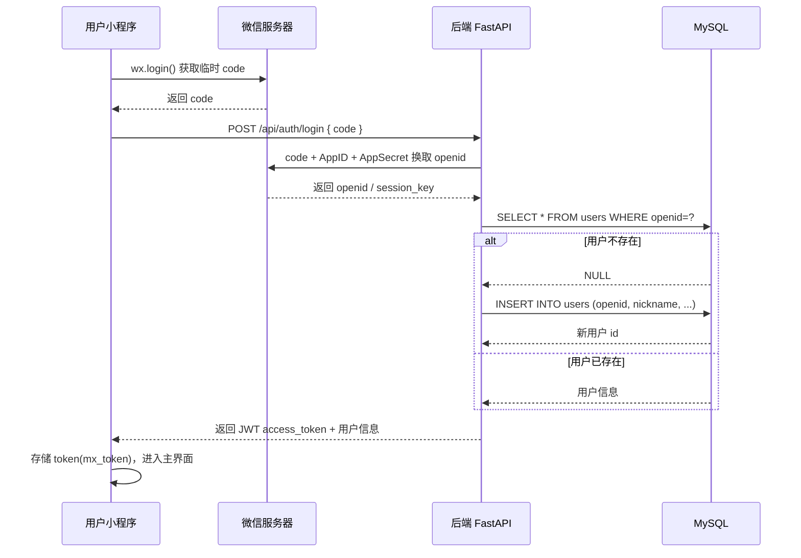
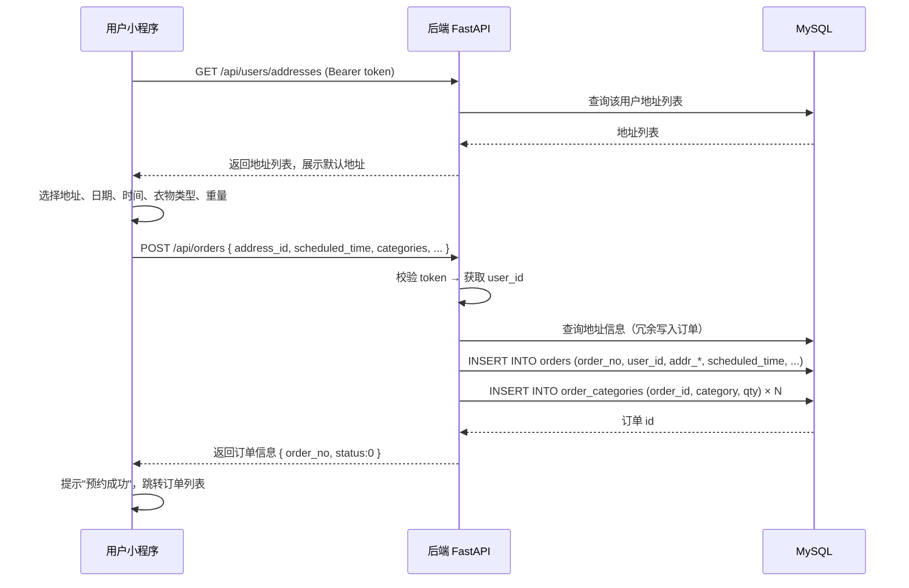
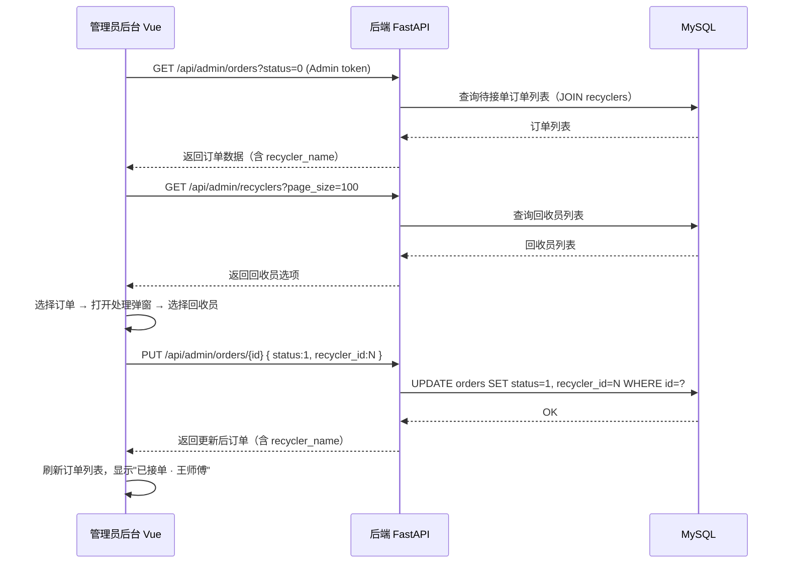
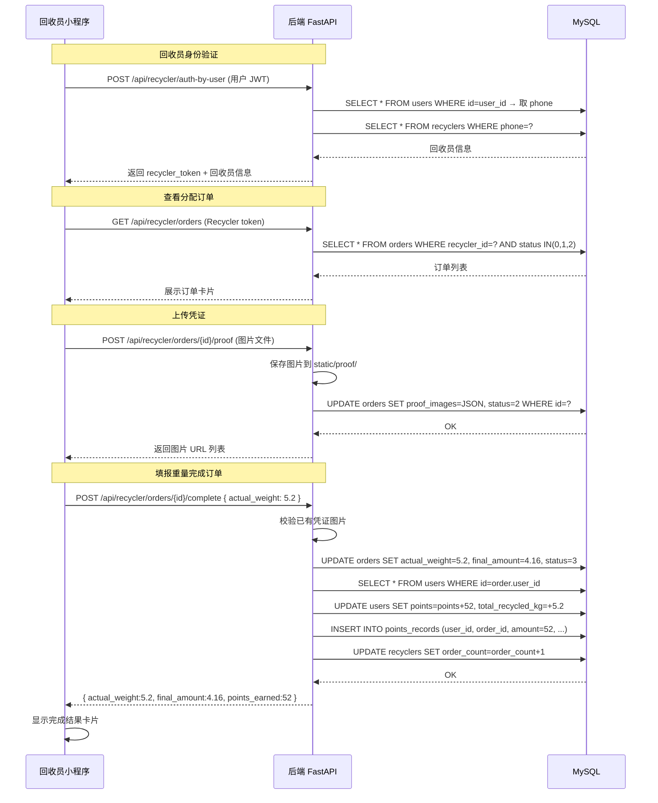
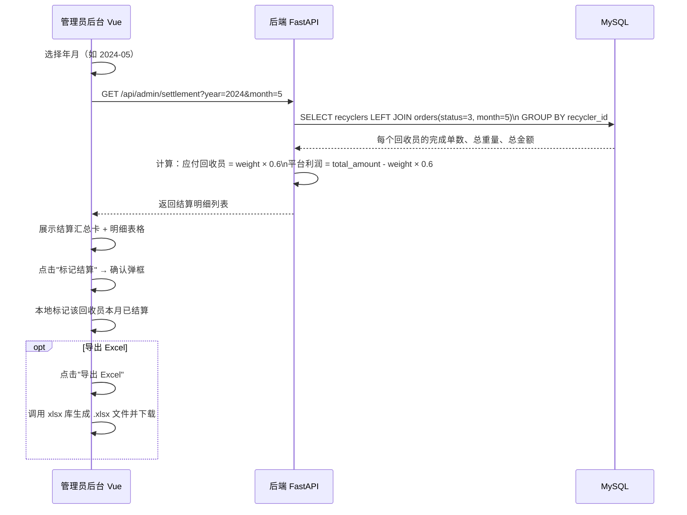
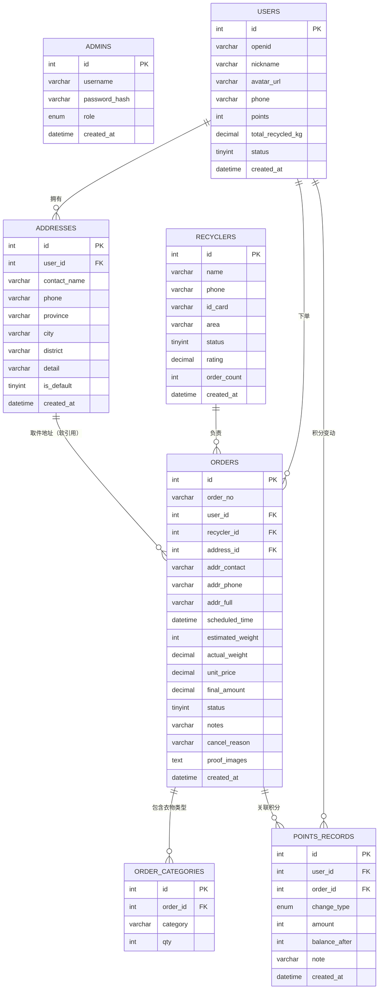
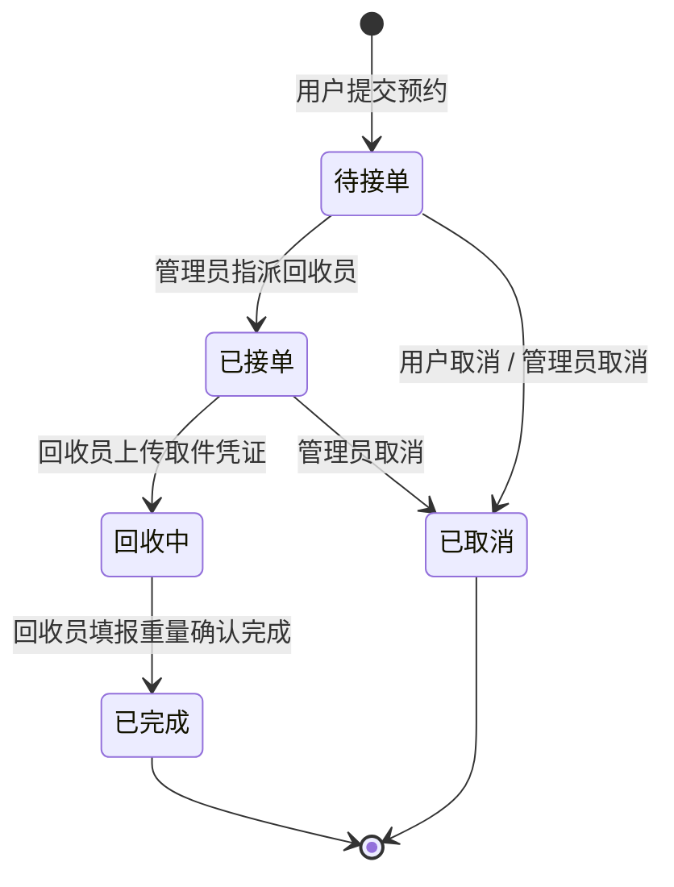
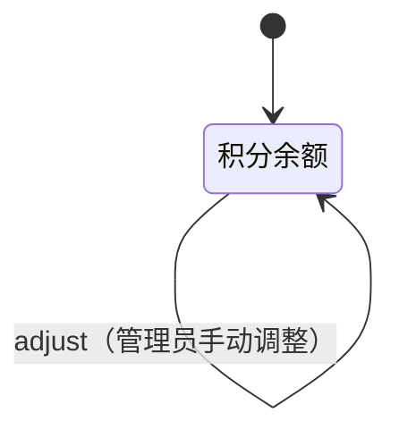

# 慢夏闲置衣服回收平台 — 设计文档

> 包含：用例规约、时序图、E-R 图

---

## 一、用例规约

### 1.1 用例列表总览

| 编号 | 用例名称 | 参与者 | 优先级 |
|------|----------|--------|--------|
| UC-01 | 微信一键登录 | 用户 | 高 |
| UC-02 | 绑定手机号（短信验证码） | 用户 | 高 |
| UC-03 | 提交回收预约订单 | 用户 | 高 |
| UC-04 | 查看/取消订单 | 用户 | 高 |
| UC-05 | 查看积分与明细 | 用户 | 中 |
| UC-06 | 编辑个人资料 | 用户 | 中 |
| UC-07 | 管理员登录后台 | 管理员 | 高 |
| UC-08 | 订单审核与派单 | 管理员 | 高 |
| UC-09 | 回收员管理（增删改查） | 管理员 | 高 |
| UC-10 | 数据统计与导出 | 管理员 | 中 |
| UC-11 | 回收员月结算 | 管理员 | 中 |
| UC-12 | 回收员进入工作台 | 回收员 | 高 |
| UC-13 | 确认接单 | 回收员 | 高 |
| UC-14 | 上传取件凭证图片 | 回收员 | 高 |
| UC-15 | 填报实际重量并完成订单 | 回收员 | 高 |

---

### UC-03：提交回收预约订单

| 项目 | 说明 |
|------|------|
| **用例编号** | UC-03 |
| **用例名称** | 提交回收预约订单 |
| **参与者** | 用户（微信小程序端） |
| **前置条件** | 用户已完成微信登录，且已添加至少一个收货地址 |
| **后置条件** | 系统生成一条状态为"待接单"的订单记录，用户可在订单列表查看 |
| **主成功场景** | 1. 用户进入"立即回收"页面 |
| | 2. 选择衣物类型（可多选：衣服/鞋包/床品/毛绒玩具） |
| | 3. 点击"取件地址"，从地址列表选择或新增地址 |
| | 4. 点击"预约日期"，从未来 7 天中选择 |
| | 5. 点击"取件时间"，从 09:00-21:00 每小时一档中选择 |
| | 6. 选择预估重量区间 |
| | 7. 可选填备注或快捷标签 |
| | 8. 点击"立即预约"，系统校验参数后提交 |
| | 9. 提交成功，系统生成订单号，跳转至订单列表 |
| **扩展场景** | 3a. 未添加地址 → 提示跳转至地址管理页新增 |
| | 8a. 未选地址/日期/时间 → 弹出对应错误提示，不提交 |
| | 8b. 网络超时 → 弹出"网络繁忙"提示，订单未提交 |
| **业务规则** | - 一次预约仅限未来 7 天内 |
| | - 单笔订单至少选择一种衣物类型 |
| | - 用户取消需在状态为"待接单"时操作 |

---

### UC-08：订单审核与派单

| 项目 | 说明 |
|------|------|
| **用例编号** | UC-08 |
| **用例名称** | 订单审核与派单 |
| **参与者** | 管理员 |
| **前置条件** | 管理员已登录后台，存在"待接单"状态的订单 |
| **后置条件** | 订单状态更新为"已接单"，指定回收员可在工作台看到该订单 |
| **主成功场景** | 1. 管理员进入订单管理页面 |
| | 2. 按状态/关键词筛选目标订单 |
| | 3. 点击"处理"按钮，打开处理弹窗 |
| | 4. 在"指派回收员"下拉框中选择合适的回收员 |
| | 5. 状态自动设置为"已接单"，也可手动调整 |
| | 6. 可上传回收凭证图片（管理端核查用） |
| | 7. 点击保存，订单更新成功 |
| **扩展场景** | 4a. 无空闲回收员 → 先在回收员管理页新增 |
| | 5a. 选择取消状态 → 需填写取消原因 |
| | 5b. 选择已完成 + 填写实际重量 → 系统自动计算结算金额并给用户积分 |
| **业务规则** | - 指派回收员后订单状态自动从 0→1 |
| | - 完成时必须填写实际重量才能结算 |

---

### UC-14 & UC-15：回收员上传凭证并完成订单

| 项目 | 说明 |
|------|------|
| **用例编号** | UC-14 / UC-15 |
| **用例名称** | 上传取件凭证 / 填报重量完成订单 |
| **参与者** | 回收员（微信小程序端） |
| **前置条件** | 回收员已通过手机号验证进入工作台，订单已分配给该回收员 |
| **后置条件** | 订单状态变为"已完成"，用户积分自动到账，回收员累计单量 +1 |
| **主成功场景** | 1. 回收员在"进行中"列表看到订单，点击"确认接单" |
| | 2. 上门取件后拍照，点击"上传凭证"，选择图片上传 |
| | 3. 凭证上传成功，订单状态变为"回收中" |
| | 4. 点击"标记完成"，输入实际重量（kg） |
| | 5. 点击"确认完成"，系统计算结算金额与积分 |
| | 6. 弹出完成结果卡：重量、结算金额、用户获得积分 |
| | 7. 订单从进行中移除，出现在"已完成"Tab |
| **扩展场景** | 2a. 图片上传失败 → 提示"上传失败"，可重试 |
| | 4a. 未上传凭证时"标记完成"按钮置灰不可点 |
| | 4b. 网络不可用 → 提示"网络繁忙" |
| **业务规则** | - 必须先上传至少 1 张凭证才能标记完成 |
| | - 积分规则：实际重量(kg) × 10 分 |
| | - 结算金额：实际重量(kg) × 0.8 元（平台到用户价） |
| | - 回收员结算：实际重量 × 0.6 元（平台支付给回收员） |

---

## 二、时序图

> 使用 Mermaid 语法，可在支持 Mermaid 的 Markdown 渲染器（如 Typora、VS Code 插件、GitHub）中查看。

---

### 2.1 用户微信登录时序图

---

### 2.2 用户提交预约订单时序图

---

### 2.3 管理员派单时序图

---

### 2.4 回收员完成订单时序图

---

### 2.5 管理员月结算时序图

---

## 三、E-R 图

---

## 四、核心业务状态机

### 订单状态流转

### 积分变动类型

---

## 五、表关系说明

| 关系 | 类型 | 说明 |
|------|------|------|
| users → addresses | 1 : N | 一个用户可有多个收货地址 |
| users → orders | 1 : N | 一个用户可提交多笔订单 |
| recyclers → orders | 1 : N | 一个回收员负责多笔订单 |
| orders → order_categories | 1 : N | 一笔订单包含多种衣物类型 |
| users → points_records | 1 : N | 用户每次积分变动记录一条流水 |
| orders → points_records | 1 : 0..1 | 订单完成时关联一条积分奖励记录 |

> **地址冗余设计说明**：`orders` 表中保留 `addr_contact / addr_phone / addr_full` 三个字段，是因为用户事后可能删除地址，若仅存 `address_id` 则历史订单无法查看取件信息。下单时将地址快照写入订单，是电商系统的通用做法。
